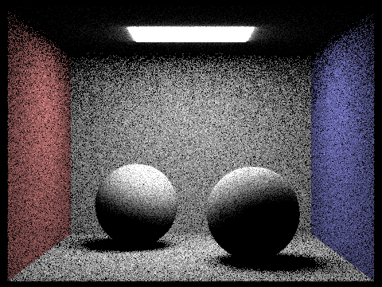
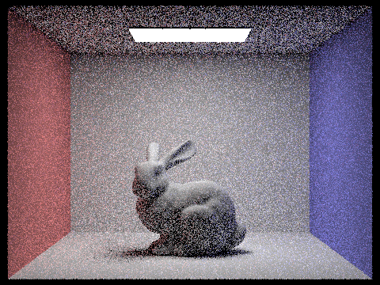
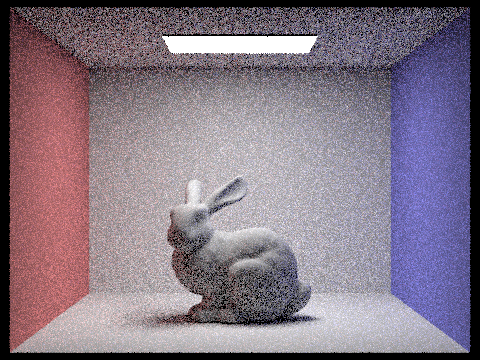

# Assignment 5

Name: An Zihang

Student ID: 121090001

## 0. Abstract

As one effective way to render, ray tracing is based on the physical laws, which make the output image authentic. This project focuses on how rays and the scene interact, and do optimizations and experiments to improve the output quality.

## Part 1: Ray Generation and Scene Intersection

For the first step of ray tracing, we have to generate (reversed) rays from camera. 

i.e. for each pixel

- shoot some rays through random positions in it $\rightarrow$  
- test whether the rays intersect with some primitives in the scene $\rightarrow$
- estimate the radiance of the intersections $\rightarrow$ 
- take average of the radiance as the rendering result of this pixel.

So the key point is how to test the intersections and how to estimate the radiance. For example, when testing the intersections with triangles, we can consider from both the ray and the triangle. 

For the ray, any point on it can be expressed as $r(t)=o+td$, where o is the origin of the ray and d is the unit direction vector. For the triangle, the intersection has to be **on the plane where the triangle locates** and **inside the triangle**. If a point is on the plane where the triangle locates, it can be expressed as $(1-b_1-b_2)P_0+b_1P_1+b_2P_2$, where $P_0,\ P_1,\ P_2$ are triangle vertices. Furthermore, if it is inside the triangle, we have $(1-b_1-b_2),\ b_1,\ b2>0$ . So the intersection satisfies $o+td=(1-b_1-b_2)P_0+b_1P_1+b_2P_2$. This is a system of ternary linear equations. It can be transformed to 
$$
\begin{bmatrix}
t \\ b_1\\ b_2
\end{bmatrix}=
\dfrac{1}{S\cdot E_1}
\begin{bmatrix}
S_2\cdot E_2 \\
S_1\cdot S\\
S_2\cdot D
\end{bmatrix}
$$
Where $E_1=P_1-P_0,\ E_2=P_2-P_0,\ S=o-P_0,\ S_1=D\times E_2,\ S_2=S\times E_1$. Also, to make it physical, $t$ should be between $min_t$ and $max_t$, otherwise we don't consider it valid.

The following are some screenshots of the rendered results.


The estimation of radiance will be involved in Part 3, 4 and 5.

## Part 2: Bounding Volume Hierarchy

The third screenshot in Part 1 took nearly 9 seconds to render (one thread), which we want to optimize. The bottleneck is that every ray has to go over all the primitives and check the intersection, even if most of them are considerably far from the ray.

So we need a kind of data structure to optimize the intersecting process. We can partition the whole set of primitives into two subsets according to their centroid coordinates. Each time we choose a splitting point of the bounding box of the current set of primitives, and do the split to make the two subsets have similar sizes.

**How to find the splitting point?** The first point we notice is that to make the shape of bounding box more cubic, we better choose splitting point with respect to the longest dimension. Then we consider the splitting standard:

One intuitive approach is to use the centroid of the bounding box. Primitives with centroids on the same side of the bounding box centroid are put into the same subset. But there can be problems with this method:


In this occasion, the bounding box is determined by the red triangle, so if the other blue triangles are all to the left of the centroid, there will be no triangle put into the right subset.

So if we focus on the primitives, we should consider all primitives. We can find the median of the centroid of the primitive bounding boxes, and choose it as the splitting point.


And finding the median can take $O(primitives.size)$ time complexity using the "quick select" algorithm, which is inspired by quicksort algorithm.

```c++
/**
 * @brief Select the median of the coordinate of the boundbox centroid
 * with respect to one axis.
 * 
 * @param axis 0 for x, 1 for y, 2 for z
 * @param left how many elements are certain to be to the left of the median
 * @param right how many elements are certain to be to the right of the median
 * @return std::vector<Primitive *>::iterator pointing to the median
 */
std::vector<Primitive *>::iterator BVHAccel::quickSelect(std::vector<Primitive *>::iterator start,
                                                         std::vector<Primitive *>::iterator end,
                                                         int axis = 0, int left = 0, int right = 0) {
    if (end - start == 1)
        return start;

    auto t = start, pi = start+1, pj = end-1;
    while (true) {
        BBox bi = (*pi)->get_bbox(),
        bj = (*pj)->get_bbox();
        double ct = (*t)->get_bbox().centroid()[axis];
        while (pi < pj && bj.centroid()[axis] > ct) {
            pj--;
            bj = (*pj)->get_bbox();
        }
        while (pi < pj && bi.centroid()[axis] <= ct) {
            pi++;
            bi = (*pi)->get_bbox();
        }
        if (pi == pj) {
            if (bi.centroid()[axis] <= ct)
                swap(*t, *pi);
            break;
        }
        swap(*pi, *pj);
    }
	// determine to go left or right
    // (pi-start+left) is the number of primitives to the left of current one
    // (end-1-pi+right) is the number of primitives to the right of current one
    // if the total number is even, the difference is at least 1, 
    // while that of odd occasion is 0.
    if (abs((pi-start+left) - (end-pi-1+right)) <= 1)// find median
        // choose the smaller medain if possible, to avoid empty node.
        return (pi-start+left) > (end-1-pi+right) ?  pi-1 : pi;
    else if ((pi-start+left) > (end-1-pi+right))
        return quickSelect(start, pi, axis, left, right+end-pi);
    else
        return quickSelect(pi+1, end, axis, left+pi-start+1,right);

    return start;
}
```

Using BVH, we can avoid judging all the primitives:


(One BVH node on the head of the cow)

Using this method, we can render the cow again with same resolution and number of threads, and the time cost comes to **0.0551s**, which is much faster than that without BVH. When we try some more complex scenes like this (105120 primitives):


This takes **14.9s** to render with BVH, **sampling 64 times per pixel**. 

But it takes **181.4s** without BVH, and **sampling only 2 times per pixel**.

There are around 105 thousand primitives. For BVH, each ray can go down the hierarchy and reduce the number of primitives to check exponentially, while normal method has to go over all primitives. Even if the number of samples is reduced to $\dfrac{1}{32}$, the time cost is still over 12 times larger. So the effect of BVH is incredible when rendering complex scenes.

## Part 3: Direct Illumination

When a ray hit the primitive, instead of normal shading, we need to estimate the radiance by considering the light coming from the scene. So we have to do sampling at the hit point and take average as the result radiance. But there are more than one way to sample.

#### Hemisphere uniform random sampling

Since we don't consider the light coming from inside the object, we only sample the hemisphere centered at the hit point. Recall the BSDF and its Monte Carlo estimation:
$$
L_{out}(p, \omega_{out}) = L_e(p,\omega_{out})+\int_{\Omega^+}L_{in}(p, \omega_{in})f_r(p, \omega_{in}, \omega_{out})\cos\theta_{in} \mathrm{d}\omega_{in}

\\
\Rightarrow L_{out}(p,\omega_{out}) =\dfrac{1}{N}\displaystyle{\sum^{N}_{j=1}\dfrac{L_{in}(p, \omega_j)f_r(p, \omega_j\rightarrow\omega_{out})\cos \theta_j}{pdf(\omega_j)}}
$$


We use the *hemisphereSampler->get_sample()* to get a random direction, this is the direction that light may come to the hit point (i.e. $w_j$ in the BSDF). Then we use *cos_theta()* to get $\cos \theta_j$ in BSDF. For hemisphere, the $pdf$ is a constant, which is $\dfrac{1}{2\pi}$. By now we have known all the arguments, and we can get the following implementation:

```c++
Vector3D
    PathTracer::estimate_direct_lighting_hemisphere(const Ray &r,
                                                    const Intersection &isect) {
    Matrix3x3 o2w;
    make_coord_space(o2w, isect.n);
    Matrix3x3 w2o = o2w.T();

    const Vector3D hit_p = r.o + r.d * isect.t;
    const Vector3D w_out = w2o * (-r.d);

    int num_samples = scene->lights.size() * ns_area_light;
    Vector3D L_out;

    for (int j = 0; j < num_samples; j++) {
        Vector3D w_j = hemisphereSampler->get_sample();

        double cos_theta_j = cos_theta(w_j);
        Ray newRay = Ray(hit_p, o2w * w_j);
        newRay.min_t = EPS_F;
        Intersection iSource;

        // Monte Carlo
        if (bvh->intersect(newRay, &iSource)) {
            Vector3D L_in = iSource.bsdf->get_emission(),
            f_r = isect.bsdf->f(w_out, w_j);
            L_out += f_r * L_in * cos_theta_j * (2 * PI);
        }
    }

    return L_out / num_samples;
}
```

With hemisphere uniform sampling, we can get these results:




#### Importance sampling

Sampling in the hemisphere can cause lots of noise. Sometimes only some directions are illuminated by the light, and hemisphere sampling can waste chances of reaching light. So we need to try to only sample the directions that are "possible" to reach the light (if not blocked).

So what we do is to trace rays to each light source, and check whether the ray is blocked. The helper function *light->sample_L()* can get the $w_j,\ pdf$ in the BSDF, and $distToLight$ can restrict the ray range so that it doesn't hit the source and treated as "blocked" by the source.

```c++
Vector3D
    PathTracer::estimate_direct_lighting_importance(const Ray &r,
                                                    const Intersection &isect) {
    Matrix3x3 o2w;
    make_coord_space(o2w, isect.n);
    Matrix3x3 w2o = o2w.T();

    const Vector3D hit_p = r.o + r.d * isect.t;
    const Vector3D w_out = w2o * (-r.d);
    Vector3D L_out;
	
    // consider each light source in the scene
    for (auto light : scene->lights) {
        int num_samples = light->is_delta_light() ? 1 : ns_area_light;
        Vector3D L_this_light = Vector3D(0, 0, 0);

        for (int j = 0; j < num_samples; j++) {
            Vector3D w_j;
            double distToLight;
            double pdf;
            Vector3D L_in = light->sample_L(hit_p, &w_j, &distToLight, &pdf); // w_j is world space

            double cos_theta_j = dot(w_j, isect.n);
            Ray shadowRay = Ray(hit_p, w_j);
            shadowRay.min_t = EPS_F;
            shadowRay.max_t = distToLight - EPS_F;
            Intersection iSource;

            if (!bvh->intersect(shadowRay, &iSource)) {
                Vector3D f_r = isect.bsdf->f(w_out, w2o * w_j);
                L_this_light += f_r * L_in * cos_theta_j / pdf;
            }
        }

        L_out += L_this_light / num_samples;
    }

    return L_out;
}
```

We can see the effect below:


noise has remarkably decreased. And if there is only one ray per pixel, the number of sample rays per light source can also affect the quality of shadow:


The screenshots above are all under 1 ray per pixel setting. With the sample rate increasing, noise decreases and the soft shadows' quality is improved.

In comparison, the problem of hemisphere sampling is too much randomness. Importance sampling cares about "among all the light coming from the sources, how much are blocked and how many not", while hemisphere cares about "among all the directions, how many directions leads to light.", so the hemisphere sampling requires huge sample rate to be more accurate.

## Part 4: Global Illumination

Besides direct light and one-bounce light, muti-bounce light is also part of global illumination. As long as we can deal with one-bounce light, we can deal with multi-bounce light, because that is to recursively repeat the one-bounce process. One thing to mention is that we can only sample once at each hit point, because sample rate larger than 1 may cause exponential explosion after recursive process. But we can take more samples per pixel to improve the accuracy.

And in order to stop the process in finite time, we can do a "Russian Roulette" to randomly determine whether we terminate the current recursion. That sounds adventurous, but it is actually right. because with a probability $p$ to terminate, we can **divide $L_{out}$ by $(1-p)$,** so that we have 
$$
E(L_{out})=p\times \dfrac{0}{p}+(1-p)\times \dfrac{L_{out}}{1-p}=L_{out}
$$
Which is acceptable.

With this terminal condition and function to deal one recursion, we can get the following implementation:

```c++
Vector3D PathTracer::at_least_one_bounce_radiance(const Ray &r,
                                                  const Intersection &isect) {
    Matrix3x3 o2w;
    make_coord_space(o2w, isect.n);
    Matrix3x3 w2o = o2w.T();

    Vector3D hit_p = r.o + r.d * isect.t;
    Vector3D w_out = w2o * (-r.d);

    Vector3D L_out(0, 0, 0);
	
    // deal with one bounce
    L_out += one_bounce_radiance(r, isect);

    double roulette_threshould = 1.0/3.0; // probability of termination
	
    // depth is used to restrict the recursive depth
    if (coin_flip(roulette_threshould) || r.depth == 1 || PART < 4)
        return L_out;

    Vector3D w_j;
    double pdf;
    Vector3D f = isect.bsdf->sample_f(w_out, &w_j, &pdf);

    Ray newRay = Ray(hit_p, o2w * w_j);
    newRay.depth = r.depth - 1;
    newRay.min_t = EPS_F;
	
    double cos_theta_j = cos_theta(w_j);// w_j is object space
	
    // recursion
    Intersection iSource;
    if (bvh->intersect(newRay, &iSource)) {
        Vector3D L_j = at_least_one_bounce_radiance(newRay, iSource);
        L_out += f * L_j * cos_theta_j / pdf / (1-roulette_threshould);
    }

    return L_out;
}
```

We can see some render results with 1024 samples per pixel and at most 5 bounces.


For the bunny, if we consider **only** direct illumination, it will look like this:


because we only consider rays directly from the light. If we only consider indirect illumination, it will look like this:


Where rays from light are ignored but the other light is presented.

Different maximum depth can also affect the render effect:


The images above uses 0, 1, 2, 3, and 100 maximum bounce times (the last one took 392s to render). At first the increment of maximum depth brings prominent improvement to the quality image, and makes it physical and authentic. When the number is relatively large, the effect is not that prominent due to termination of the recursions. Finally each pixel will converge to the real physical effect.

Also, the quality of the image is related to the number of samples per pixel.







The images above adopt 1, 2, 4, 8, 16, 64, and 1024 samples per pixel. As the sample rate increase, the image is less and less noisy. That is intuitively because we sample more, and the result converges to the real world. It is also a representation of the correctness of Monte Carlo estimation. If we want an image with less noise, we should improve the number of samples per pixel, which is also costly (the last image took 1579 seconds to render, with max_ray_depth=5).

## Part 5: Adaptive Sampling

We may realize that doing too much sampling to some directions in the scene is not necessary, such as the walls and the floor of the Cornell box, they don't require large sample rate to be not noisy. But some other positions need more sample rate to guarantee low noise, like the arms, legs and belly of the bunny. So we introduce Adaptive Sampling to deal with these conditions more intelligently.

Briefly, we can set a threshold, if some pixel is considered too noisy, we keep sampling on it until it fulfills our expectation. To lower the time cost, we can deal with the rays for one pixel **in batches**, keep recording the data about the mean and variance of the illumination, and check once we have processed a batch of rays.

```c++
void PathTracer::raytrace_pixel(size_t x, size_t y) {
    int num_samples = ns_aa;          // total samples to evaluate
    int batch_accu = 0;				  // number of samples in current batch
    Vector2D origin = Vector2D(x, y); // bottom left corner of the pixel
    Vector3D resColor = Vector3D(0, 0, 0); // The result color of the given pixel
    double s1 = 0, s2 = 0;
	
    // n is the actual total number of samples
    int n = 1;
    for (; n <= num_samples; n++) {
        Vector2D randomPos = gridSampler->get_sample() + origin;
        Ray sampleRay = camera->generate_ray(1.0 * randomPos.x / sampleBuffer.w,
                                             1.0 * randomPos.y / sampleBuffer.h);
        sampleRay.depth = max_ray_depth;
        Vector3D radiance = est_radiance_global_illumination(sampleRay);
        resColor += radiance; // sample once

        if (PART == 5) {
            double illum = radiance.illum();
            s1 += illum;
            s2 += illum * illum;

            batch_accu++;
            if (batch_accu == samplesPerBatch) {
                batch_accu = 0;

                double illum_mean = s1 / n,
                illum_variance = (1.0 / (n-1)) * (s2 - s1 * s1 / n),
                I = 1.96 * sqrt(illum_variance / n);

                if (I <= maxTolerance * illum_mean)
                    break;
            }
        }
    }

    sampleBuffer.update_pixel(resColor / n, x, y);
    sampleCountBuffer[x + y * sampleBuffer.w] = n;
}
```

The following image is rendered using 2048 rays per pixel, and 5 maximum bounce times. The next image is the visualization of the sample rate of the scene. Red zones represent high sample rate, while Blue zones represent low sample rate. With adaptive sampling, we can reduce the noise without too much overall cost. (the image took 513 seconds to render)


